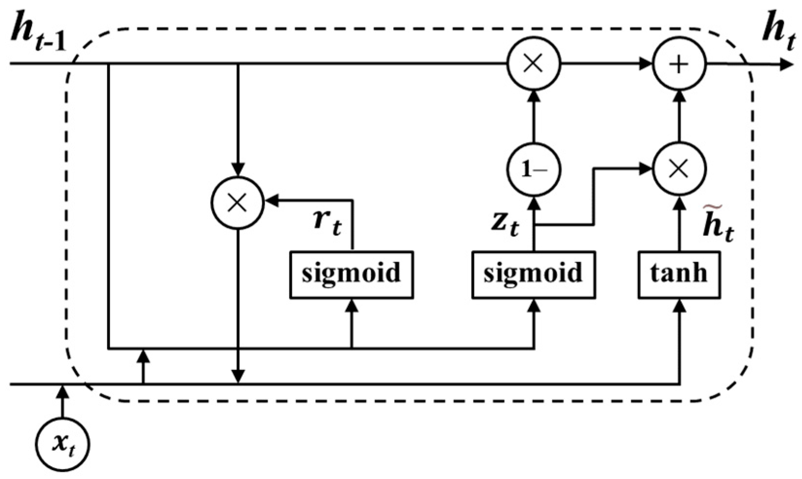
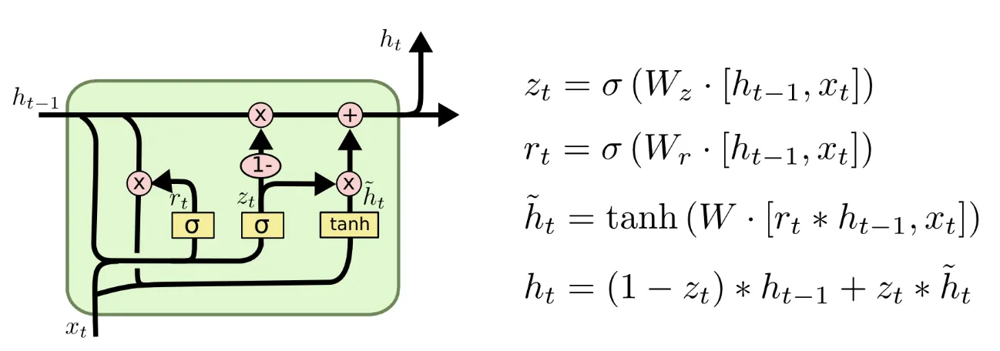

# GRU from Scratch — Derivation & Implementation

A **Gated Recurrent Unit (GRU) network built from scratch in NumPy** — no
deep-learning framework for the model itself. This repository has two halves:

1. **The theory** — a complete, hand-derived account of how a GRU works: the two
   gates (update + reset), the candidate hidden state, the hidden-state
   interpolation, the softmax + cross-entropy gradient, and full
   **Backpropagation Through Time (BPTT)** through the gates, with every step shown
   explicitly and illustrated.
2. **The code** — that derivation turned directly into a readable, stacked (multi-layer)
   NumPy implementation, trained with BPTT and used to generate text word-by-word.
   The same architecture is also rebuilt in **TensorFlow/Keras** and
   **PyTorch**, and all three are compared side by side on the same data.

The task throughout is **next-word prediction**: inputs are dense word-embedding
vectors and the model predicts the next word at every step.

> Educational project: the goal is to make the mechanics of a GRU explicit and
> readable, not to be fast or state-of-the-art.

> **Note on the diagrams.** The cell diagrams in `Images/` show the GRU forward pass and
> use the same variable names as the derivation below — `h⟨t⟩` (hidden state), `z⟨t⟩`
> (update gate), `r⟨t⟩` (reset gate), `h̃⟨t⟩` (candidate), with weights `W_z, W_r, W`.

---

# Part 1 — How a GRU Works (Derivation)

A complete mathematical derivation of forward propagation and backpropagation through
time (BPTT) for a GRU, including the two gate equations, the candidate hidden state, the
softmax gradient, the cross-entropy loss gradient, and the vector/matrix gradient rules.

> **Notation.** Following the cell diagrams, the hidden state is `h⟨t⟩`, the update and
> reset gates are `z⟨t⟩` and `r⟨t⟩`, the candidate is `h̃⟨t⟩`, and the gate weights are
> `W_z, W_r, W` (with biases `b_z, b_r, b`). The diagrams use the textbook **column-vector**
> form, e.g. `z⟨t⟩ = σ(W_z·[h⟨t-1⟩, x⟨t⟩] + b_z)`. The **code derives and implements the
> equivalent batch-first / row-vector layout**: data is shaped `(m, T_x, n_x)` (examples
> are rows), the gate-input concatenation is `concat = [h_prev, x]` of shape
> `(m, n_a + n_x)`, and a gate is `σ(concat · Wᵀ + b)` — weights stored as
> `(n_a, n_a + n_x)` and applied **transposed, to the right of the data**. The two forms
> are exact transposes of each other: the gradients are identical and only the orientation
> differs. **Every backward equation in §7 is written in the batch-first form, matching the
> NumPy code line for line.**
>
> **Code mapping.** The from-scratch code in [`gru_scratch.py`](gru_scratch.py) names the
> hidden state `a` (`a_prev`, `a_next`, `a_top`), the candidate weight `Wh`/`bh` (the `W`/`b`
> here), and the hidden-state size `n_a`. The math below uses the diagrams' `h`/`W`; the two
> are the same quantities under different names.

## Table of Contents

- [GRU from Scratch — Derivation \& Implementation](#gru-from-scratch--derivation--implementation)
- [Part 1 — How a GRU Works (Derivation)](#part-1--how-a-gru-works-derivation)
  - [Table of Contents](#table-of-contents)
  - [1. GRU Architecture Overview](#1-gru-architecture-overview)
  - [2. Forward Propagation](#2-forward-propagation)
  - [3. Softmax — Definition \& Gradient](#3-softmax--definition--gradient)
  - [4. Loss Function — Cross-Entropy](#4-loss-function--cross-entropy)
  - [5. Gradient of Loss w.r.t. Logits](#5-gradient-of-loss-wrt-logits)
  - [6. Gradient of Vectors and Matrices](#6-gradient-of-vectors-and-matrices)
  - [7. Backpropagation Through Time (BPTT) — batch-first](#7-backpropagation-through-time-bptt--batch-first)
    - [Output layer (per timestep)](#output-layer-per-timestep)
    - [1 — Into the hidden state, and through the interpolation](#1--into-the-hidden-state-and-through-the-interpolation)
    - [2 — Through the candidate](#2--through-the-candidate)
    - [3 — Through the two gates](#3--through-the-two-gates)
    - [4 — Carry to the previous step](#4--carry-to-the-previous-step)
  - [8. Summary of Gradient Equations](#8-summary-of-gradient-equations)
- [Part 2 — The Code](#part-2--the-code)
  - [Pipeline](#pipeline)
  - [Project structure](#project-structure)
    - [`gru_scratch.py` — the from-scratch model](#gru_scratchpy--the-from-scratch-model)
    - [`gru_tensorflow.py` / `gru_pytorch.py` — framework versions](#gru_tensorflowpy--gru_pytorchpy--framework-versions)
    - [`compare.py` — side-by-side comparison](#comparepy--side-by-side-comparison)
    - [`utils.py` — data \& inference helpers](#utilspy--data--inference-helpers)
  - [Setup](#setup)
  - [Usage](#usage)
  - [Reference](#reference)

---

## 1. GRU Architecture Overview

A vanilla RNN carries a single hidden state `h⟨t⟩` across time and updates it by
overwriting it at every step. Because that update repeatedly multiplies by the same
recurrent weight, gradients either **vanish** or **explode** over long sequences, so the
network struggles to learn long-range dependencies.

A **GRU** fixes this with two **gates** and a single hidden state — no separate cell
state. The **update gate** `z⟨t⟩` decides how much of the hidden state to overwrite with a
freshly computed **candidate** `h̃⟨t⟩`, and the **reset gate** `r⟨t⟩` decides how much of the
past hidden state feeds into that candidate. When the update gate stays near zero the
hidden state is carried forward almost unchanged, which is the "gradient highway" that
lets information (and gradients) travel many steps without being squashed. The GRU gets
the same benefit as an LSTM with fewer parameters (two gates instead of three, and no
cell state).

**One state carried across time:**
- `h⟨t⟩` — hidden state (the cell's output, also fed to the next step and the output layer)

**Parameters (shared across all time steps), per stacked layer:**
- `W_z, b_z` — update gate
- `W_r, b_r` — reset gate
- `W, b` — candidate hidden state
- `W_y, b_y` — output (dense) layer: top hidden state → logits

Each gate weight acts on the concatenation `[h⟨t-1⟩, x⟨t⟩]`, so a single matrix mixes the
previous hidden state and the current input.

---

## 2. Forward Propagation

At each step `t` the cell concatenates the previous hidden state with the current input,
computes the two gates and the candidate, then interpolates between the old hidden state
and the candidate.



**Update gate** — how much of the candidate to write into the hidden state:
```
z⟨t⟩ = σ(W_z · [h⟨t-1⟩, x⟨t⟩] + b_z)
```

**Reset gate** — how much of the past hidden state feeds the candidate:
```
r⟨t⟩ = σ(W_r · [h⟨t-1⟩, x⟨t⟩] + b_r)
```

**Candidate hidden state** — the proposed new content, computed from the *reset-gated*
previous state (element-wise `∗`):
```
h̃⟨t⟩ = tanh(W · [r⟨t⟩ ∗ h⟨t-1⟩, x⟨t⟩] + b)
```

**Hidden-state update** — interpolate between the old state and the candidate:
```
h⟨t⟩ = (1 − z⟨t⟩) ∗ h⟨t-1⟩ + z⟨t⟩ ∗ h̃⟨t⟩
```

**Output logits and probabilities** (at every step — many-to-many next-token modelling):
```
y⟨t⟩ = W_y · h⟨t⟩ + b_y
ŷ⟨t⟩ = softmax(y⟨t⟩)
```

> **Batch-first form (what the code computes).** With `concat = [h⟨t-1⟩, x⟨t⟩]` shaped
> `(m, n_a + n_x)` and weights stored as `(n_a, n_a + n_x)`, each gate is
> `σ(concat · Wᵀ + b)` and the candidate is `h̃ = tanh([r ∗ h_prev, x] · Wᵀ + b)`. The
> hidden-state interpolation is unchanged (it is element-wise). See
> [`gru_scratch.py`](gru_scratch.py), `layer_forward`.

---

## 3. Softmax — Definition & Gradient

The output layer is identical to a plain classifier, so the softmax + cross-entropy
gradient is derived once here and reused for the GRU's per-step output.

The softmax of logit vector `y` at index `i` is:

$$s_i = \frac{e^{y_i}}{\sum_{k=1}^{n} e^{y_k}}$$

We can write this as `s_i = h(y) / g(y)` where:

$$h(y) = e^{y_i}, \qquad g(y) = \sum_{k=1}^{n} e^{y_k}$$

The derivative with respect to `y_j` (quotient rule):

$$\frac{\partial s_i}{\partial y_j} = \frac{h'(y)\, g(y) - g'(y)\, h(y)}{(g(y))^2}$$

We need:

$$\frac{\partial h(y)}{\partial y_j} = h'(y) = e^{y_i} \quad \text{(if } i = j\text{, else 0 → constant)}$$

$$\frac{\partial g(y)}{\partial y_j} = \frac{\partial}{\partial y_j} \sum_{k=1}^{n} e^{y_k} = e^{y_j}$$

**Case i: j = i (diagonal).** When `i = j`, `h'(y) = e^{y_i}` and `g'(y) = e^{y_i}`:

$$\frac{\partial s_i}{\partial y_j} = \frac{e^{y_i} \cdot \sum e^{y_k} - e^{y_i} \cdot e^{y_i}}{(\sum e^{y_k})^2} = \frac{e^{y_i}}{\sum e^{y_k}} \left(1 - \frac{e^{y_j}}{\sum e^{y_k}}\right)$$

$$\boxed{\frac{\partial s_i}{\partial y_j} = s_i (1 - s_j)} \quad \text{when } j = i$$

**Case ii: j ≠ i (off-diagonal).** When `i ≠ j`, `h'(y) = 0`:

$$\frac{\partial s_i}{\partial y_j} = \frac{0 - e^{y_j} \cdot e^{y_i}}{(\sum e^{y_k})^2} = -s_i \cdot s_j$$

$$\boxed{\frac{\partial s_i}{\partial y_j} = -s_i s_j} \quad \text{when } j \neq i$$

**Combined Jacobian of softmax:**

$$\frac{\partial s_i}{\partial y_j} = \begin{cases} s_i(1 - s_j) & \text{if } j = i \\ -s_i s_j & \text{if } j \neq i \end{cases}$$

---

## 4. Loss Function — Cross-Entropy

For a correct class index `m`, the cross-entropy loss is:

$$\ell = -\log(s_m), \qquad s_m = \frac{e^{y_m}}{\sum_{k} e^{y_k}}$$

The gradient with respect to `s_m`:

$$\frac{\partial \ell}{\partial s_m} = -\frac{1}{s_m}$$

---

## 5. Gradient of Loss w.r.t. Logits

By the chain rule, the loss gradient flows back through the softmax to the logits:

$$\frac{\partial \ell}{\partial y_j} = \frac{\partial \ell}{\partial s_m} \cdot \frac{\partial s_m}{\partial y_j}$$

**Case i: j = m.** Using `∂s_m/∂y_j = s_m(1 - s_j)`:

$$\frac{\partial \ell}{\partial y_j} = -\frac{1}{s_m} \cdot s_m(1 - s_j) = s_j - 1$$

$$\boxed{\frac{\partial \ell}{\partial y_j} = s_m - 1} \quad \text{if } j = m$$

**Case ii: j ≠ m.** Using `∂s_m/∂y_j = -s_m · s_j`:

$$\frac{\partial \ell}{\partial y_j} = -\frac{1}{s_m} \cdot (-s_m \cdot s_j) = s_j$$

$$\boxed{\frac{\partial \ell}{\partial y_j} = s_j} \quad \text{if } j \neq m$$

**Combined:**

$$\frac{\partial \ell}{\partial y_j} = \begin{cases} s_m - 1 & \text{if } j = m \\ s_j & \text{if } j \neq m \end{cases}$$

> **Intuition:** This is simply `ŷ - one_hot(true_label)` — the predicted probability
> vector minus the ground-truth indicator. This is exactly the `y_pred - Y` you'll see in
> the code (`dscores = (y_pred - Y) / (m * T_x)`).

---

## 6. Gradient of Vectors and Matrices

For a linear transformation `y = Wx`, the gradients are:

$$\frac{\partial L}{\partial W} = \frac{\partial L}{\partial y} \cdot x^T, \qquad \frac{\partial L}{\partial x} = W^T \cdot \frac{\partial L}{\partial y}$$

**Intuition:** The weight gradient is the outer product of the upstream gradient and the
input. The input gradient backpropagates the upstream error through the transpose of the
weight matrix. These two rules differentiate every linear step in the GRU gates.

> **Batch-first form.** With examples as rows (`y = z·Wᵀ + b`, `z` shaped `(m, ·)`), the
> same rules read `∂L/∂W = (∂L/∂y)ᵀ · z` and `∂L/∂z = (∂L/∂y) · W`, with the bias gradient
> `∂L/∂b = Σ_rows ∂L/∂y` summed over the batch. These are the exact lines used in §7.

---

## 7. Backpropagation Through Time (BPTT) — batch-first

BPTT walks the sequence in reverse, routing the gradient through each cell and
accumulating it into the shared gate weights. A GRU cell carries a single state, so it
receives one incoming gradient — `dh_next` (into the hidden state, from the next step) —
which is added to the upstream gradient from the output layer, and emits `dh_prev` and
`dx`, plus the parameter gradients.



All equations below are in the **batch-first** layout the code uses: the gate concatenation
`concat = [h_prev, x_t]` of shape `(m, n_a + n_x)`, the reset-gated concatenation
`concat_r = [r⟨t⟩ ∘ h_prev, x_t]`, gates of shape `(m, n_a)`, and weights of shape
`(n_a, n_a + n_x)`. They match [`gru_scratch.py`](gru_scratch.py) `layer_backward` line for
line. (`n_a` is the hidden-state size; the code names the state `a`, the candidate weight
`Wh`, and `concat` is `concat`/`concat_r`.)

### Output layer (per timestep)

With `scores = h_top · W_yᵀ + b_y` and the softmax+CE result from §5,
`dscores = (ŷ − Y) / (m·T_x)`. Applying the batch-first rules of §6 across the batch and
time axes:

$$\frac{\partial L}{\partial W_y} = \sum_{t} (\text{dscores}^{\langle t\rangle})^T \cdot h_{\text{top}}^{\langle t\rangle}, \qquad \frac{\partial L}{\partial b_y} = \sum_{m,t}\text{dscores}, \qquad \frac{\partial L}{\partial h_{\text{top}}} = \text{dscores} \cdot W_y$$

That `dh_top` is the gradient fed into the top recurrent layer at every timestep.

### 1 — Into the hidden state, and through the interpolation

Total gradient into `h⟨t⟩` (sum of the upstream from above and the carry from the next step):

$$dh = dh_{\text{above}}^{\langle t\rangle} + dh_{\text{next}}$$

The hidden-state update `h⟨t⟩ = (1 − z) ∘ h⟨t-1⟩ + z ∘ h̃` splits `dh` three ways — into
the update gate, into the candidate, and straight back to `h⟨t-1⟩` along the skip path:

$$dz = dh \,\circ\, (\tilde{h} - h^{\langle t-1\rangle}), \qquad d\tilde{h} = dh \,\circ\, z, \qquad dh_{\text{prev}} \mathrel{+}= dh \,\circ\, (1 - z)$$

### 2 — Through the candidate

The candidate `h̃ = tanh(concat_r · Wᵀ + b)` with `concat_r = [r ∘ h_prev, x]`. Back through
the `tanh` (`1 − h̃²`), then the linear step (§6):

$$d\tilde{h}_{\text{raw}} = d\tilde{h} \,\circ\, (1 - \tilde{h}^{\,2}), \qquad \frac{\partial L}{\partial W} \mathrel{+}= d\tilde{h}_{\text{raw}}^{\,T} \cdot \text{concat}_r, \qquad \frac{\partial L}{\partial b} \mathrel{+}= \sum_{\text{batch}} d\tilde{h}_{\text{raw}}$$

$$d\,\text{concat}_r = d\tilde{h}_{\text{raw}} \cdot W \quad\Rightarrow\quad d(r \!\circ\! h_{\text{prev}}) = d\,\text{concat}_r[:, :n_a], \qquad dx^{\langle t\rangle} \mathrel{+}= d\,\text{concat}_r[:, n_a:]$$

The reset-gated term splits between the reset gate and another contribution to `h_prev`:

$$dr = d(r \!\circ\! h_{\text{prev}}) \,\circ\, h^{\langle t-1\rangle}, \qquad dh_{\text{prev}} \mathrel{+}= d(r \!\circ\! h_{\text{prev}}) \,\circ\, r$$

### 3 — Through the two gates

Each gate is `σ(concat · Wᵀ + b)` with `concat = [h_prev, x]`. Back through the sigmoid
(`σ'(x) = σ(1−σ)`) and the linear step:

$$dz_{\text{raw}} = dz \,\circ\, z(1-z), \qquad dr_{\text{raw}} = dr \,\circ\, r(1-r)$$

$$\frac{\partial L}{\partial W_z} \mathrel{+}= dz_{\text{raw}}^{\,T} \cdot \text{concat}, \qquad \frac{\partial L}{\partial W_r} \mathrel{+}= dr_{\text{raw}}^{\,T} \cdot \text{concat}, \qquad \frac{\partial L}{\partial b_\bullet} \mathrel{+}= \sum_{\text{batch}} d\bullet_{\text{raw}}$$

Each gate's input gradient splits back into the hidden-state and input halves and is
accumulated into `dh_prev` / `dx`:

$$dh_{\text{prev}} \mathrel{+}= (dz_{\text{raw}} \cdot W_z)[:, :n_a] + (dr_{\text{raw}} \cdot W_r)[:, :n_a]$$

$$dx^{\langle t\rangle} \mathrel{+}= (dz_{\text{raw}} \cdot W_z)[:, n_a:] + (dr_{\text{raw}} \cdot W_r)[:, n_a:]$$

### 4 — Carry to the previous step

`dh_prev` has now collected **four** contributions — the skip path `(1 − z)`, the
reset-gated candidate path `r`, and the hidden halves of both gate inputs. Carry it back:

$$dh_{\text{next}} \leftarrow dh_{\text{prev}} \quad \text{into step } t-1.$$

In a stacked GRU the `dx` of a layer becomes the `dh_above` of the layer below.

> **Why GRUs train better than RNNs.** When the update gate `z ≈ 0`, the hidden-state
> update is `h⟨t⟩ ≈ h⟨t-1⟩` and its gradient carry is `dh_prev ≈ dh ∘ (1 − z) ≈ dh` —
> the gradient passes back through many steps almost undamped, with **no repeated `tanh`
> factor and no fixed recurrent matrix**. That additive, gated carry is the same
> vanishing-gradient cure the LSTM's cell state provides, achieved here with one gate
> fewer and no separate state.

---

## 8. Summary of Gradient Equations

| Quantity | Gradient (batch-first) |
|---|---|
| Loss `∂ℓ/∂y` (softmax+CE) | `ŷ − Y` |
| `∂L/∂W_y` | `Σₜ dscoresᵀ · h_top` |
| `∂L/∂h_top` | `dscores · W_y` |
| `dh` (into `h⟨t⟩`) | `dh_above + dh_next` |
| `dz` (update gate) | `dh ∘ (h̃ − h⟨t−1⟩)` |
| `dh̃` (candidate) | `dh ∘ z` |
| `dh̃_raw` (candidate pre-act) | `dh̃ ∘ (1 − h̃²)` |
| `d concat_r` (reset-gated concat) | `dh̃_raw · W`  (concat_r = `[r ∘ h_prev, x]`) |
| `dr` (reset gate) | `d concat_r[:, :n_a] ∘ h⟨t−1⟩` |
| `dz_raw` / `dr_raw` (pre-act) | `dz ∘ z(1−z)` / `dr ∘ r(1−r)` |
| `∂L/∂W_z`, `∂L/∂W_r` | `dz_rawᵀ · concat`, `dr_rawᵀ · concat`;  `∂L/∂W` = `dh̃_rawᵀ · concat_r` |
| `∂L/∂b•` | `Σ_batch d•_raw` |
| `dh_prev` | `dh∘(1−z) + d concat_r[:, :n_a]∘r + (dz_raw·W_z)[:, :n_a] + (dr_raw·W_r)[:, :n_a]` |
| `dx⟨t⟩` | `d concat_r[:, n_a:] + (dz_raw·W_z)[:, n_a:] + (dr_raw·W_r)[:, n_a:]` |

---

# Part 2 — The Code

The implementation turns the derivation above directly into NumPy as a **stacked
(multi-layer) GRU**, trained with full BPTT and used to predict and generate text
word-by-word.

To put the from-scratch model in context, the same architecture is then built two more
ways — with **TensorFlow/Keras** and with **PyTorch** — and all three are compared on the
same data, architecture, and hyper-parameters. The notebook runs this 3-way comparison
across four word-embedding encoders (Word2Vec, pre-trained GloVe, FastText, and a
pre-trained BERT Transformer).

## Pipeline

```
word corpus → vocabulary → sliding-window sequences → train/test split
            → train GRU (mini-batch BPTT) → evaluate (train/test accuracy) → predict / generate
```

- **Next-word model** — inputs are dense word-embedding vectors (Word2Vec / GloVe /
  FastText / BERT); the GRU predicts a probability distribution over the vocabulary and
  generates text one word at a time.
- **3-way comparison** — the manual NumPy GRU, a Keras model, and a PyTorch model are
  trained on the same split and compared by train/test accuracy and sample generations.

## Project structure

```
GRU/
├── gru_scratch.py           # the from-scratch GRU: stacked layers, forward, loss, BPTT, training
├── gru_tensorflow.py        # KerasGRU  — same architecture/interface, built with TensorFlow/Keras
├── gru_pytorch.py           # PyTorchGRU — same architecture/interface, built with PyTorch
├── compare.py               # compare_models — train/test accuracy + generation across models
├── utils.py                 # data prep + split + evaluate + inference (predict_next, generate)
├── gru_building_scratch.ipynb   # end-to-end walkthrough + 3-way comparison (4 word encoders)
├── Images/                  # diagrams used in this README
├── requirements.txt         # Python dependencies
└── README.md
```

### `gru_scratch.py` — the from-scratch model

`GRU` stacks one or more recurrent layers (set with `hidden_layers`, e.g. `(100,)` for one
layer or `(100, 64)` for two), carries a per-layer hidden state `a` across `T_x` time
steps, and is trained with **mini-batch** gradient descent over the gradients accumulated
by BPTT. Each method maps onto a section of the derivation above.

| Method | Role | Derivation |
| --- | --- | --- |
| `initialize_parameters` | per-layer gate weights `Wz/Wr/Wh, bz/br/bh` plus the output layer `Wy, by` | §1 |
| `layer_forward` | run one GRU layer (both gates + candidate) over the whole sequence | §2 |
| `gru_forward` | stack the layers, then apply the output projection at every step | §2 |
| `compute_loss` | cross-entropy (classification) or MSE (regression) | §4 |
| `layer_backward` / `gru_backward` | BPTT for one layer / down through the stack, with gradient clipping | §5–§7 |
| `update_parameters` | one gradient-descent step | — |
| `train` | the full mini-batch loop: forward → loss → backward → clip → update | — |
| `predict` | forward pass returning per-step probabilities `(m, T_x, n_y)` | §2 |

It supports two tasks:

- `task="classification"` — softmax output + cross-entropy loss (one-hot targets).
- `task="regression"` — linear output + mean-squared-error loss (real-valued targets).

In both cases the per-step output gradient reduces to `y_pred - Y`, exactly the
`ŷ − y_true` derived in §5.

> **A stabilizing trick in the code:** gradients are **clipped to a global norm of 5.0**
> before each update (keeps BPTT through long sequences from exploding). Unlike an LSTM,
> the GRU has no forget-gate bias to initialize — the update gate's additive carry plays
> that role.

> **Layout note.** The tensors use the standard **batch-first** layout `(m, T_x, n_x)`,
> so examples are rows and each gate is `concat @ Wᵀ + b` with `concat = [a_prev, x]`
> (weights to the *right* of the data). The Part 1 diagrams write the same step with column vectors;
> the two are transposes of each other and produce identical results — and §7 derives the
> backward pass directly in this batch-first form.

### `gru_tensorflow.py` / `gru_pytorch.py` — framework versions

`KerasGRU` and `PyTorchGRU` mirror the from-scratch model: they take the **same
constructor inputs** (`X, Y, hidden_layers, learning_rate, epochs, batch_size, task`) and
expose the same `train()` / `predict()` interface, so the helpers in `utils.py` and
`compare.py` work on them unchanged. They are standalone — each trains natively (stacked
`keras.layers.GRU` / `nn.GRU`, Adam optimizer) and `predict` runs its own framework
forward, returning the same `(m, T_x, n_y)` layout. They do **not** share weights with the
manual model.

> Because the frameworks optimize with **Adam** and the from-scratch model with plain
> **SGD + gradient clipping**, their learned weights and accuracies differ — this is a
> realistic "library vs scratch" comparison, not a bit-for-bit match.

### `compare.py` — side-by-side comparison

`compare_models(models, X_train, Y_train, X_test, Y_test, ...)` takes a
`{name: trained_model}` mapping and prints a **train/test accuracy** table (or MSE for
regression) plus a sample generation for each model. Training is done by the caller, so you
can compare all three models or just the manual one.

### `utils.py` — data & inference helpers

- `generate_dataset(words, T_x, word_vectors)` — slides a window of length `T_x` over the
  word corpus and builds the `(m, T_x, n_x)` embedding-input and `(m, T_x, n_y)` one-hot
  target tensors.
- `train_test_split(...)` — splits the sequences into train/test partitions.
- `evaluate(...)` — next-word accuracy (classification) or MSE (regression) on given data.
- `predict_next(...)` — one word in, the single most likely next word out (argmax).
- `generate(...)` — autoregressive generation, optionally sampling from the predicted
  distribution for more varied output.

`predict_next` / `generate` rely only on a model's `predict` method, so the same calls
drive the manual GRU and both framework wrappers identically.

**Tensor convention** used throughout:

| Symbol | Meaning |
| --- | --- |
| `n_x` | input feature size (word-embedding vector size) |
| `n_y` | output feature size (vocab size) |
| `m`   | number of training sequences |
| `T_x` | time steps per sequence |
| `n_a` | hidden state size of a layer |

## Setup

```bash
# (recommended) create and activate a virtual environment
python -m venv .venv
source .venv/bin/activate        # Windows: .venv\Scripts\activate

# install dependencies
pip install -r requirements.txt

# register the environment as a Jupyter kernel (optional)
python -m ipykernel install --user --name=gru-env --display-name="Python (gru-env)"
```

> The notebook downloads pre-trained embeddings/models (GloVe via `gensim.downloader`,
> BERT via `transformers`) on first run, so the first execution needs an internet
> connection and some disk space.

## Usage

Open the notebook for the full walkthrough:

```bash
jupyter notebook gru_building_scratch.ipynb
```

Or use the modules directly — next-word example (using gensim word vectors as the encoder):

```python
from gensim.models import Word2Vec
from gru_scratch import GRU
from utils import generate_dataset, train_test_split, evaluate, predict_next, generate

# train (or load) word vectors to use as the input encoder
sentences = [s.split() for s in corpus_lines]
words = [w for s in sentences for w in s]
w2v = Word2Vec(sentences, vector_size=100, window=5, min_count=1, sg=1).wv

# build sliding-window embedding sequences, then split into train/test
X, Y, vocab_to_index, index_to_vocab = generate_dataset(words, T_x=5, word_vectors=w2v)
X_train, X_test, Y_train, Y_test = train_test_split(X, Y, test_size=0.2)

# train a stacked GRU (hidden_layers sets the number and size of layers)
model = GRU(X_train, Y_train, hidden_layers=(100, 64),
            learning_rate=0.03, epochs=15, batch_size=32, task="classification")
model.train()

# evaluate + generate
print("test accuracy:", evaluate(model, X_test, Y_test))
print(predict_next(model, w2v, index_to_vocab, "Machine"))
print(generate(model, w2v, index_to_vocab, seed_word="Machine", num_words=10, sample=True))
```

Compare all three implementations on the same data:

```python
from gru_scratch import GRU
from gru_tensorflow import KerasGRU
from gru_pytorch import PyTorchGRU
from compare import compare_models

cfg = dict(hidden_layers=(100,), learning_rate=0.03, epochs=15, batch_size=32, task="classification")
models = {
    "manual (numpy)": GRU(X_train, Y_train, **cfg),
    "tensorflow":     KerasGRU(X_train, Y_train, **cfg),
    "pytorch":        PyTorchGRU(X_train, Y_train, **cfg),
}
for m in models.values():
    m.train()

# train/test accuracy table + a sample generation from each model
compare_models(models, X_train, Y_train, X_test, Y_test,
               embedding=w2v, decoder=index_to_vocab,
               seed_word="Machine", num_gen=10, sample=True)
```

---

## Reference

The architecture diagrams and the overall framing of the forward/backward passes follow
the **[DeepLearning.AI Sequence Models course](https://www.coursera.org/learn/nlp-sequence-models)**
on Coursera (taught by Andrew Ng). The from-scratch NumPy implementation and the
hand-worked gradient derivations in this repository are built on the notation and intuition
from that course.
